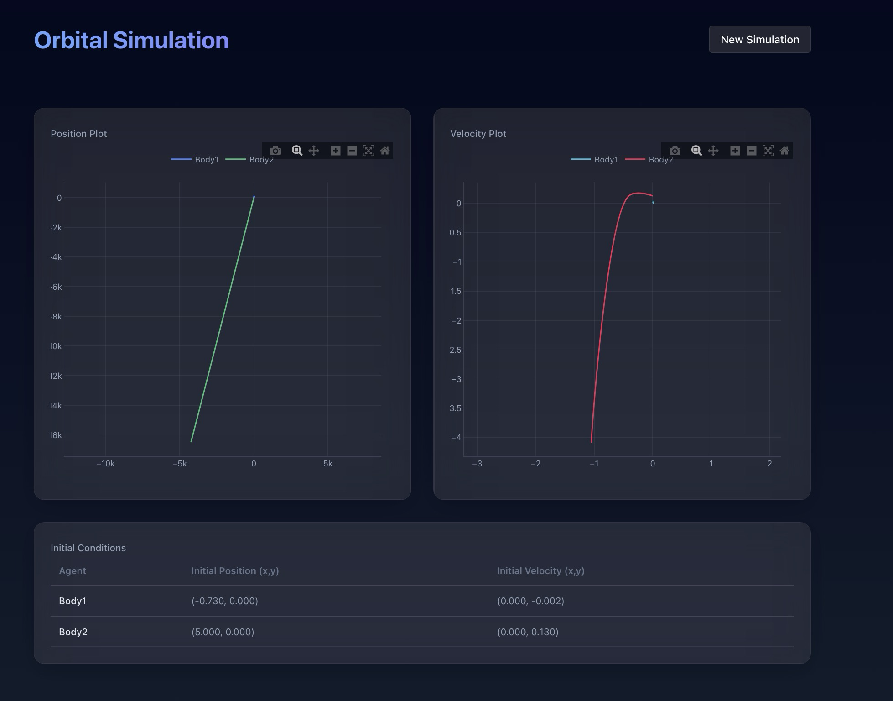
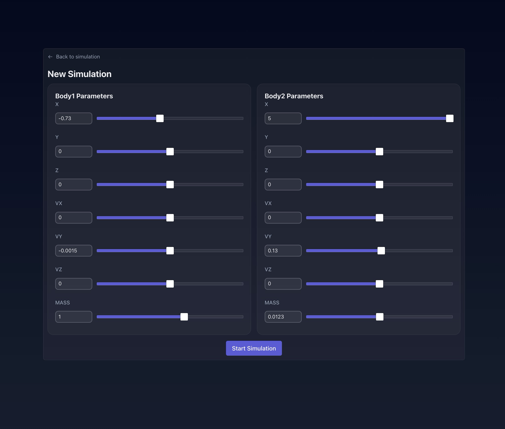

# Changes I made to this repo

## Challenges
Originally I wanted to work on the Flask app and make improvements there, especially to the database and optimize it. However, I ran into some issues with the database and was not able to get it to run properly, and I believed I was wasting more time so I ended moving to the react app.

## I updated the UI for the react app

- This included updated chart Look, feel, and responsiveness
- Added some pop in animations when page loads, at first i ran into issues page load speeds, and overall components were not performant
- For example using the form and dragging sliders was very laggy
- I later resolved this by changing the animations to be hardware accelerated
- Enhanced simulation form UI with:
  - Modern glass-morphic design
  - Improved input fields and slider controls
  - Separate cards for Body1/Body2 parameters
  - Responsive animations and hover effects
  - Better visual hierarchy and spacing

## Plot Improvements

- Redesigned plot styling with:
  - Dark theme integration
  - Transparent backgrounds
  - Custom grid styling
  - Improved legend positioning
  - Responsive sizing
  - Interactive hover states

## Layout and Typography

- Implemented consistent spacing and layout
- Added gradient text effects for headings
- Improved table readability with hover states
- Enhanced button and link interactions
- Better mobile responsiveness

## Performance Optimizations

- Implemented component memoization
- Added debounced form updates
- Used hardware-accelerated animations
- Optimized re-renders

## If I was given more time

I would like to optimize the flask app more, and make it more efficient. I would also like to add some more features to the simulation, such as adding more bodies to the simulation and seeing how they interact with each other. 

In regards to the react app, I would most likely combine the form and the simultation into one page, and have it set up so you can modify the simulation parameters on the fly. I believe this would be a lot more visually appealing and functional for users to actually see the changes they are making to the simulation.

